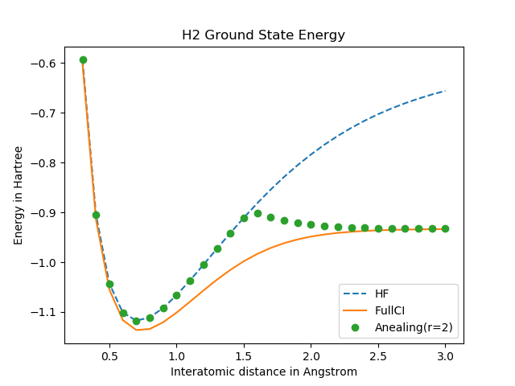
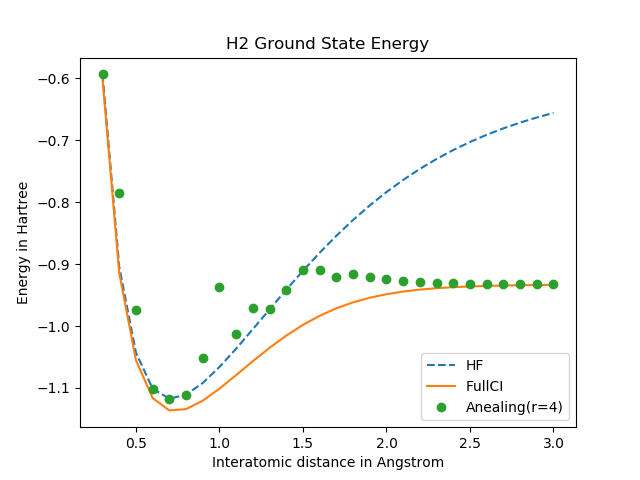
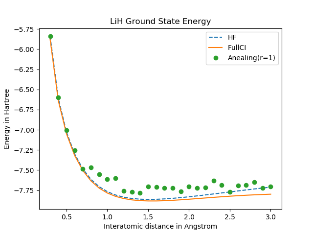
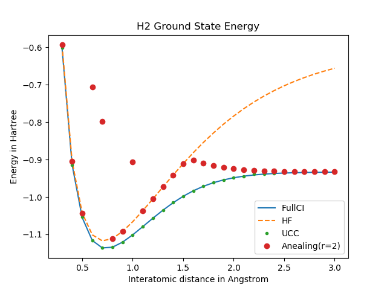

# [MDR 第３回量子プログラミングコンテスト](https://mdrft.com/2019/04/02/%E7%AC%AC%E4%B8%89%E5%9B%9E%E9%87%8F%E5%AD%90%E3%83%97%E3%83%AD%E3%82%B0%E3%83%A9%E3%83%9F%E3%83%B3%E3%82%B0%E3%82%B3%E3%83%B3%E3%83%86%E3%82%B9%E3%83%88/)

## Author
GitHub: MatsuTaku
Qiita: @MatsuTaku
twitter: @MatsuTaku
slack Blueqat: MatsuTaku

## 量子アニーリング(シミュレータ)で$\rm{LiH}$の基底状態エネルギーを計算する

### 手順

#### 量子アニーリングに入力するイジングモデル形式のハミルトニアンを得る
  1. openfermion(+psi4) を活用し，$\rm{LiH}$の各分子間距離の基底関数を計算しておく．
  (計算済みデータは`./ising_solver/diatomic/...`
    プログラムは`ising_solver/generate_diatomic.py`)
  2. fermion operator形式のハミルトニアンをbravyi kitaev変換し，pauli operator$(\sigma_{x, y, z}^i)$で表現できる形式にする．
  3. ハミルトニアン$H$を$\sigma_{x, y, z}^i$オペレータで表現される$n$-qubit空間$|\psi\rangle$から，$\sigma_z^{i_j}$オペレータのみで表現される任意の($r \times n$)-qubit空間$|\Psi\rangle$の$H'(=\sum_{j,k\leq r} H'_{j, k})$に変換する．[2]式(7)を参考．
$$ \sigma_x^i \rightarrow \frac{1-\sigma_z^{i_j}\sigma_z^{i_k}}{2}S'(j)S'(k) \\
 \sigma_y^i \rightarrow i\frac{\sigma_z^{i_j}-\sigma_z^{i_k}}{2}S'(j)S'(k) \\
 \sigma_z^i \rightarrow \frac{\sigma_z^{i_j}+\sigma_z^{i_k}}{2}S'(j)S'(k) \\
 I^i \rightarrow \frac{1+\sigma_z^{i_j}\sigma_z^{i_k}}{2}S'(j)S'(k)
$$
$S'(j)$は後述する符号関数.
  実装は以下
  `ising_solver.transform.ising_hamiltonian_matrix(hamiltonian, r_qubits, verbose) -> [[blueqat.pauli.Expr]] # r x r 行列`

##### ハミルトニアン$H$の基底状態を解くための準備
 2. ($r\times n$)空間ハミルトニアンに対する単位行列(?)$C$を計算する．[1]式(14)と(15)の間の説明を参考.
$$ C = \sum_{\pm} \left(\sum_j^r \left(\prod_i^n \frac{ 1 \pm \sigma_z^{i_j}}{2}\right)S'(j)\right)^2
$$
 これを`blueqat.pauli.Expr`などを利用して式のまま実装するとものすごく効率が悪いので，以下の式のように解釈して実装する．
(上の式を計算すると，ほとんどの項が打ち消し合う性質があります．以下の式は，打ち消されない項を表現しています．また，任意の$|\Psi\rangle$を入力すると整数([1]の$\sum_m b_m^2$)が得られます．)
$$ C = r +  2^{-n+1} \sum_{x=0}^{2^n-1} \sum_{j, k}^{{}_r C_2} \left(\prod_i^n \{\sigma_z^{i_j}\sigma_z^{i_k}(x/2^{i-1}\ \mathrm{mod}\ 2 = 0), \\
 1 (\mathtt{otherwise})\}\right) S'(j)S'(k)
$$
 実装は以下
 `ising_solver.model.ElectronicStructureCalculator.C(sign) -> blueqat.pauli.Expr`

##### $H$の基底状態を解く
 1. 符号関数$S'(j)$をパラメータ$k$に対して定義する．
 $$ S'(j) = \left\{-1\ (j = k), 1\ \mathtt{(otherwise)}\right\} \\
 (0 \leq k \leq \lfloor r/2 \rfloor)
 $$
1. $H'-\lambda C$の固有値$e$が最小となる$|\Psi\rangle$を**量子アニーリング**で計算する．
`blueqat.opt.Opt`では`Expr`を入力として扱えないので，多体形式のハミルトニアンを直接シミュレーションできる`ising_solver.opt_clone.OptAnealer`を実装．
2. 得られた固有ベクトルから$(\sum_m b_m^2 \neq 0)$を計算．
$$\sum_m b_m^2 = \mathrm{eigenvalue\ of\ }|\Psi \rangle\mathrm{\ for\ C}$$
3. $\lambda$を更新し，$e >= 0$となるまで1.から繰り返す．
$$\sum_m b_m^2(\lambda'-\lambda) = \mathrm{eigenvalue\ of\ }|\Psi\rangle\mathrm{\ for\ }H'-\lambda C = e \\
\lambda \leftarrow \frac{e}{\sum_m b_m^2}+\lambda$$
4. 最終的な$\lambda$が$k$における$H$の基底状態エネルギーである．

以上の操作を各$k$に対して計算し，最小のエネルギー固有値を得ることで計算が完了する．

実装は`blueqat.model.ElectronicStructureCalculator.get_ground_state_energy()`

#### 量子アニーリングシミュレーション
実機ではハミルトニアンを2体問題に分解しなければならないが，シミュレータなので多体問題のまま扱う．
`blueqat.pauli.Expr`のままでは使い勝手が良くないので，`numpy.array`行列形式に変換する．
$n$qubitのハミルトニアン$H$は以下の形式で表現される．$m$は$H$の項数，$c_j$は$H$の第$j$項の係数である．
$$ H = \sum_j^m c_j \prod_{i}^{u \subseteq \{1,\dots ,n\}} \sigma_z^i \\
(\sigma_z = \{1, -1\})
$$
ここで，第$k$項に対する$i$番目のパウリ$z$オペレータの可否を$0,1$で表現したバイナリ行列$B_{m\times n}$を準備する．
また，係数列$C=[c_1,c_2,\dots,c_m]$を準備する．
```math
e.g.\ H = \sigma_z^1 + 2\sigma_z^1\sigma_z^2 - 3\sigma_z^2 \\
B = \left[\begin{matrix} 1& 0 \\ 1& 1 \\ 0& 1 \end{matrix} \right] \\
C = \left[1, 2, -3\right]
```
これにより，$i$番目の量子ビットに対応する係数列が$CB_{i}$として取り出すことができる．
```math
e.g.\ Cにおいて\sigma_z^2に対応する係数列 \\
 = CB_2 = \left[0,2,-3\right]
```
つまり第$i$ビットのエネルギー$E$に対する影響 $\delta E = \sigma_z^i \|CB_i\|_1$ を元に現在の温度に従って確率的にスピンを反転させていくことで平衡状態の計算を行う．
$$ e.g.\ \sigma_z^2 = 1の場合\\ \delta E = \sigma_z^2\|CB_2\|_1 = 0+2-3 = -1
$$
$i$ビットを反転させた場合，$C^{k+1} \leftarrow C^k - 2C^kB_i $として係数列の更新を行う．
実装は`blueqat.opt_clone.OptAnealer.run()`

#### 補足
量子アニーリングシミュレーションで用いるパラメータは以下の通りである．
- 初期温度, 終末温度
- 温度低下率
- 各温度における各スピン演算子の更新頻度
- 測定回数
今回扱うハミルトニアンは多体問題であり，非常に多くの局所解が存在する．
その中から最小のエネルギーを持つ固有状態を探すため，ある程度多くの測定回数が必要になる．
全体としての計算量を落とすため，温度低下率や更新頻度に関しては多少粗目の設定をしている．


### 実験
##### 基底関数系
  - sto-3g
##### 計算リソース
  - CPU: Intel core i7 4 GHz
  - RAM: 16 GB 1867 MHz DDR3

#### とりあえず$H_2$
$r=2$では文献[2]の通りの結果が得られた．
$r=1$ではハミルトニアンの横磁場が消滅するため，平均場のみを考慮するHFと同じ結果が得られると期待していたが，何故か$r=2$と同じような結果に...
$r=4$ではハミルトニアンが複雑になり，基底状態に到達しづらくなる．
いろいろ工夫したが，結局は最適解が得られる確率と計算時間のトレードオフになる．
また，$r=1$の場合と同様に文献とは異なる結果が得られているようだ．
このあたりの要因がどこにあるのかは分析できなかった．

r|1|2|4
-|:-:|:-:|:-:
locality of $H'$  | 4  | 8  |  16
terms of $H'$   | 11  | 176  | 971
shots  |50   | 100  | 400  
計算時間  |  48 s | 35 m  |  5.3 h
-| | |
それぞれ温度変化率や平衡状態探索時の更新頻度は調整しながら実験したため，実行時間は参考程度に思ってほしい．


#### 恐る恐る$LiH$
$r=1$ではショット数を200と設定したが，多くの原子間距離でアニーラにより基底状態に到達できていない．しかし概ねHFに漸近する傾向が見られ，一部は期待値通りの結果が得られた．
r|1|2|4
-|:-:|:-:|:-:
locality of $H'$  | 12  | 24  |  48
terms of $H'$   | 79  |  $10^6$ | $10^{11}$
shots  |500   | 100  | -  
計算時間  |  3134 s | about 1 month  | -
-| | - | Unmeasurable
同じく実行時間は目安である．

### まとめ
今回は量子アニーリングによる$LiH$の基底状態エネルギーの計算をシミュレーションで再現してみた．
結果としては，ハミルトニアンの複雑性から非常に計算時間を有し，また局所解が多く存在することから最適解が得られる確率が低く，期待通りの結果をなかなか得ることができなかった．
どうやら電子構造計算において量子アルゴリズムは励起状態の計算に秀でているとのことなので，

今回の実装を通じて，イジングモデルにおけるハミルトニアンの扱いに関して多少知見を深めることができたことは収穫である．

### おまけ
私は当初，イジングモデルで扱うハミルトニアンを2-localityに分解し，`blueqat.opt.Opt.run()`で計算する作戦で実装していた．方法は，[1]式(26)を元のハミルトニアンに対し再帰的に適応する．
$$ \mathrm{min}(\sigma_z^1 \sigma_z^2 \prod_{i=3}^n \sigma_z^i) = \mathrm{min}\left( 7 + \prod_{i=3}^i\sigma_z^n - 3\sigma_z^1 - 3\sigma_z^2 + 6\sigma_z^{n+1} + 2\prod_{i=3}^{n+1}\sigma_z^i - \sigma_z^1\prod_{i=3}^{n}\sigma_z^i - \sigma_z^2\prod_{i=3}^{n}\sigma_z^i - 4\sigma_z^1\sigma_z^{n+1} - 4\sigma_z^2\sigma_z^{n+1} + \sigma_z^1\sigma_z^2 \right)
$$
実装は以下
`ising_solver.transform.two_locality_hamiltonian() -> blueqat.pauli.Expr`
これを`ising_solver.opt_clone.OptClone`に入力する．

ちなみに$H_2$では以下のような結果が得られた．一部基底状態に到達していない箇所があるが，実装は成功していたと思われる．


しかしこのlocality 削減アルゴリズムを再帰的に実行する場合，もとのハミルトニアンのlocalityに対して空間・時間計算量が指数関数的に増大することになる．
実際に$LiH$に対し$r=2$で計算を行ったところ，locality=20の項を2-localityまで削減するあたりで計算不能に陥った．
(文献[2]ではD-Waveでの実験結果まで載せているが，再現に至るまで理解が追いつかず)

そこでアニーリングのプログラムを多体問題のままシミュレーションする作戦に切り替えた．
実機ではハミルトニアンは2-locality以下でしか扱えず，シミュレータでもそれを前提として計算するべきなのかと思っていたため，それはある意味反則なのではないかと思っていたが，先日@YuichiroMinatoさんのQiitaの記事に「[アニーリング多体相互作用シミュレータを作ってみた。](https://qiita.com/YuichiroMinato/items/93b032fc8da1a67556ff)」があり，シミュレータとしてはありと判断．
よって今回の実装に至った．

### 参考
[1] R. Xia, T. Bian, S. Kais. Electronic Structure Calculations and the Ising Hamiltonian. *The journal of Physical Chemistry B*. March, 2017.
https://pubs.acs.org/doi/abs/10.1021/acs.jpcb.7b10371
[2] M. Streif, F. Neukart, M. Leib. Solving Quantum Chemistry Problems with a D-Wave Quantum Annealer. 2019
http://arxiv.org/abs/1811.05256
